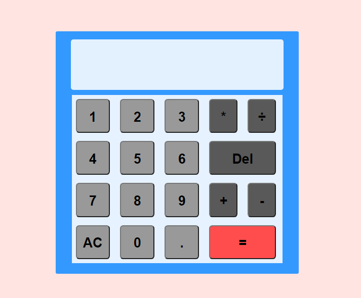

# Calculator
The point of this project was to improve my skills in JavaScript, CSS, HTML and also Sass preprocessor was used(BEM methodology helped a lot to organize this process).
## Why use it?
This calculator will be very helpful to you in solving simple calculations.
## Features
Here you can:
* Add
* Multiply
* Substract
* Divide

whole and decimal numbers.
## Built with:
* JS
* HTML
* CSS
* Sass
* BEM
## To run this project:
Install **npm** to your system and use this command : 
1. `npm install`;
2. `npm init`;
2. `npm run dev/serve`.

Then, open this index.html file with Live Server in your browser.
## Screenshot

